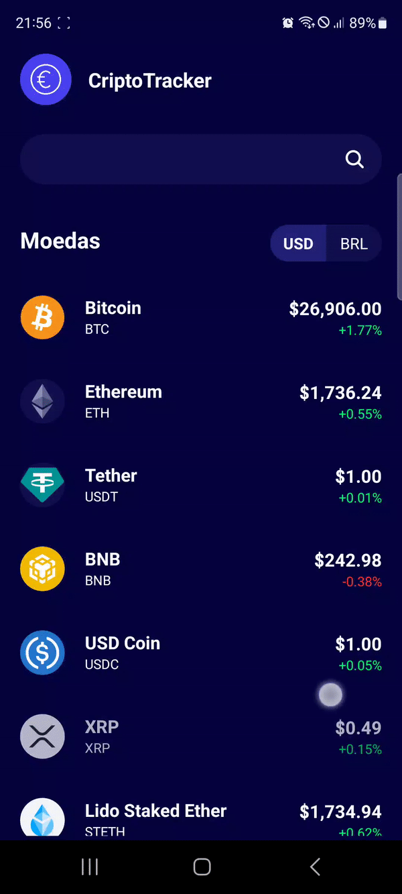

# cripto-app

<a href="https://drive.google.com/file/d/11xwBoJBtP_UjWdMeGK330aQqY4WhFPy0/view?usp=sharing">[Link] Download do App - Google Drive</a>

  

## Sobre o projeto
Aplicativo criado para acompanhar as principais informações de criptomoedas. Conta com um sistema de listagem das principais moedas, sistema de busca, gráfico de preço, escolha entre R$ e US$ para mostrar o valor dos ativos etc.
